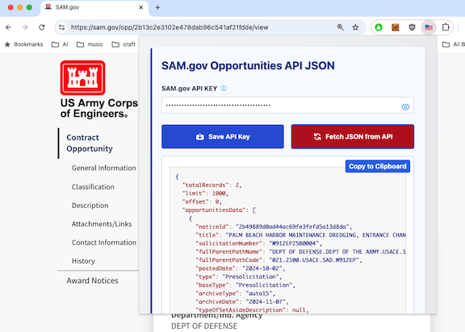

# Chrome Extension: View SAM.gov Opportunity JSON

This Chrome extension allows you to view the JSON data for a specific opportunity on SAM.gov. 
**Not all opportunities have JSON data available via this extension**

### Installation

1. Clone this repository
2. Open Chrome and navigate to `chrome://extensions`
3. Enable `Developer mode` in the top right corner of the page
4. Click `Load unpacked extension`
5. Select the `dist` folder within the cloned repository

### Build

1. `npm install`
2. `npm run build`

### Usage

1. Navigate to a SAM.gov opportunity page, e.g., https://sam.gov/opp/2b13c2e3102e478dab96c541af21fdde/view
2. Click the extension US flag icon
3. Enter your SAM.gov Account [API_KEY](https://open.gsa.gov/api/get-opportunities-public-api/#authentication-and-api-keys), save, and proceed to fetch the Opportunity JSON

## License
Copyright 2024 Geoff Ereth

Licensed under the Apache License, Version 2.0 (the "License");
you may not use this file except in compliance with the License.
You may obtain a copy of the License at

    http://www.apache.org/licenses/LICENSE-2.0

Unless required by applicable law or agreed to in writing, software
distributed under the License is distributed on an "AS IS" BASIS,
WITHOUT WARRANTIES OR CONDITIONS OF ANY KIND, either express or implied.
See the License for the specific language governing permissions and
limitations under the License.